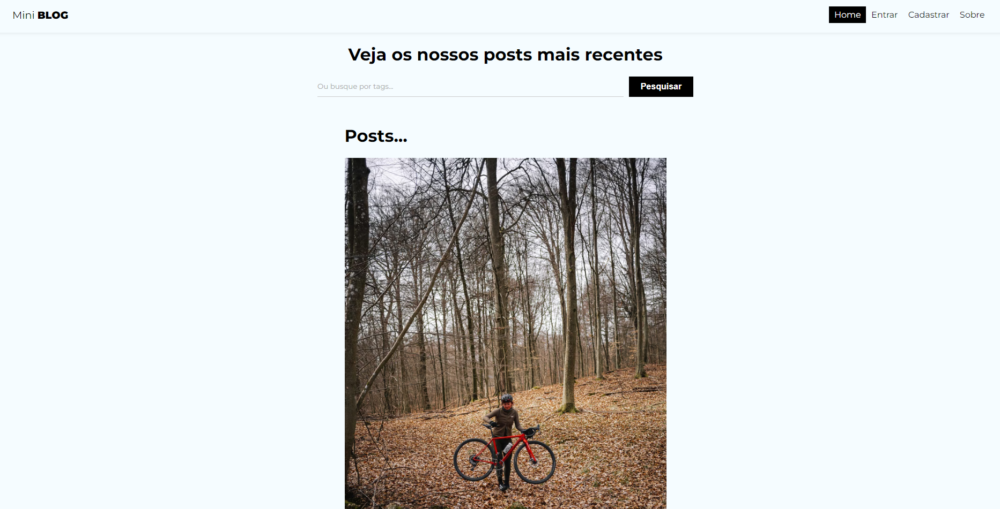
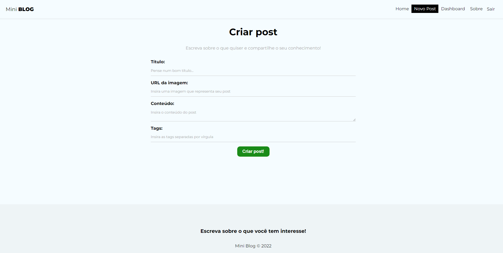

# MiniBlog

## :computer: Sobre o Projeto

MiniBlog é um site que mostra as postagens mais recentes no topo da página principal.
O post se compõem em Título, Imagem, Nome do usuário que publicou o post e Tags. Ou se o usuário
preferir, pode fazer um busca do post por tags.

O projeto possui um sistema de autenticação, onde os usuários podem se cadastrar ou realizar
o login (caso já possuir um cadastrado autenticado).

O projeto possui um Dashboard, onde é exibido todos os posts postados pelo usuário logado.
Cadas post possui 3 ações, que são: Ver, Editar e Excluir.

<p align="center"><em>Confira o resultado em: <a href="https://miniblog-vitor.vercel.app/" target="_blank">miniblog-vitor.vercel.app</a></em></p>

## Imagens

<div>
   
   
</div>

## :rocket: Techs

<ul>
  <li> HTML</li>
  <li> CSS3 </li>
  <li> Javascript </li>
  <li> ReactJS </li>
  <li> Firebase </li>
</ul>

## Desenvolvimento

---

### Pré-requisitos

- Instalar [Node.js](https://nodejs.org)

### Clone o repositório

```bash
$ git clone https://github.com/vitorgaletti/miniblog.git
```

### Executar Projeto

```bash
# Mudar para directório
$ cd miniblog/
```

- Instalar dependências

```bash
$ npm install
```

- Execute

```bash
$ npm start
```

- Executar scripts

|           Ação            | Utilização  |
| :-----------------------: | :---------: |
| Iniciar o desenvolvimento | `npm start` |
|  Compilar para produção   | `npm build` |

## Autor

- [@vitorgaletti](https://github.com/vitorgaletti)
